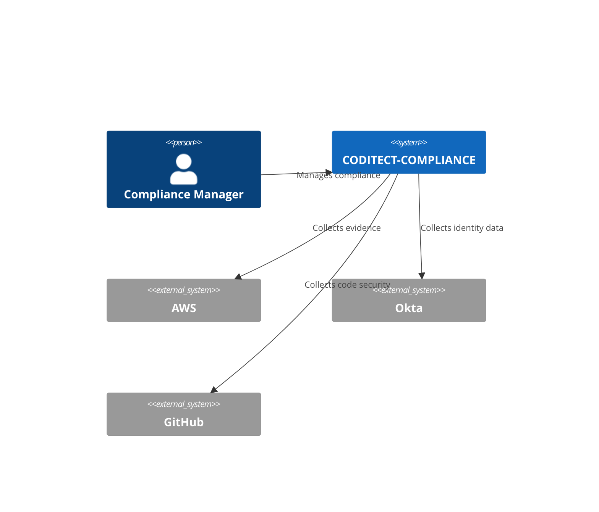
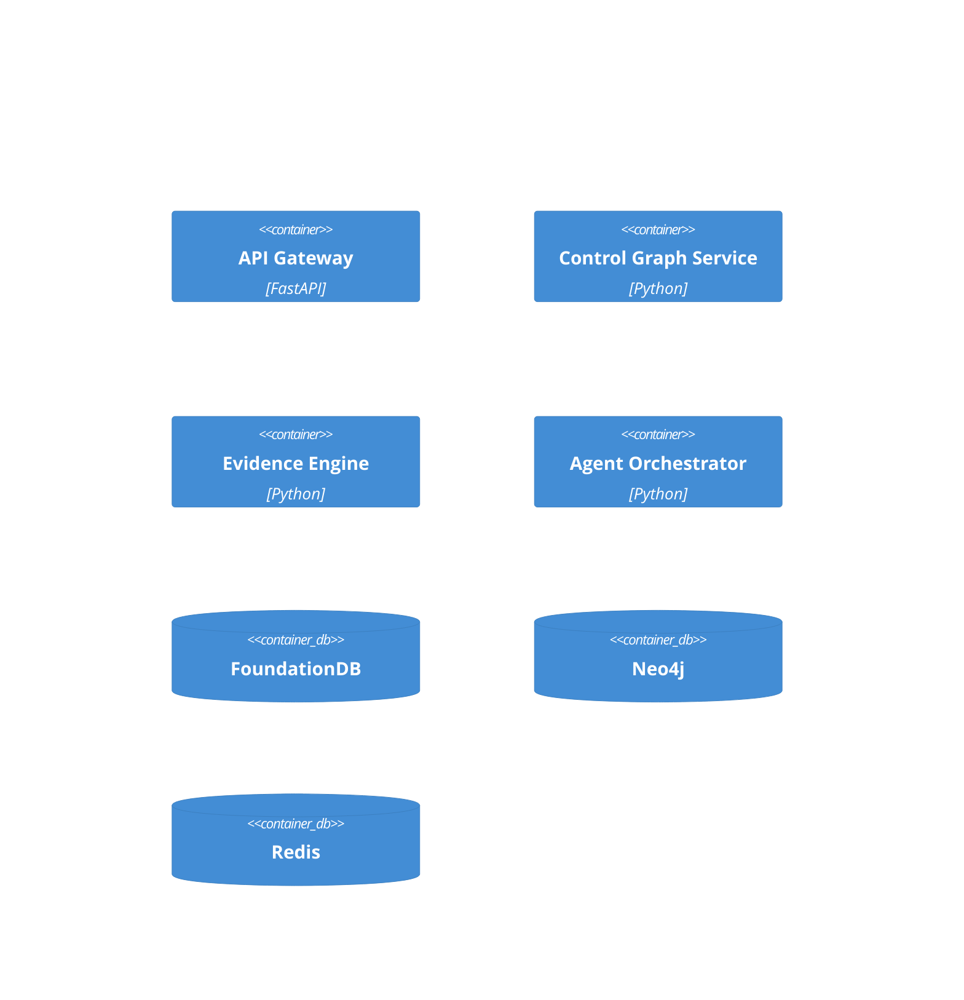

# Prompt 20: Component Build - Documentation

## Context

You are a senior technical writer creating comprehensive documentation for CODITECT-COMPLIANCE. This includes API documentation, user guides, developer guides, and operational runbooks.

## Output Specification

Generate complete documentation suite for the compliance platform. Output should be 3,000-5,000 words of documentation.

## Documentation Requirements

### Technology Stack
- MkDocs with Material theme
- OpenAPI/Swagger for API docs
- Mermaid for diagrams
- Docusaurus for developer portal

## Documentation Specifications

### 1. API Reference

```markdown
# File: docs/api/overview.md

# CODITECT-COMPLIANCE API Reference

## Overview

The CODITECT-COMPLIANCE API provides programmatic access to compliance automation capabilities.

### Base URL
```
Production: https://api.compliance.coditect.ai/v1
Staging: https://api.staging.compliance.coditect.ai/v1
```

### Authentication

All API requests require a Bearer token:

```bash
curl -H "Authorization: Bearer YOUR_API_TOKEN" \
  https://api.compliance.coditect.ai/v1/frameworks
```

### Rate Limits

| Tier | Requests/min | Burst |
|------|-------------|-------|
| Starter | 100 | 20 |
| Growth | 500 | 100 |
| Enterprise | 2000 | 500 |

---

## Frameworks

### List Frameworks

```http
GET /frameworks
```

**Query Parameters**

| Parameter | Type | Description |
|-----------|------|-------------|
| status | string | Filter by status (active, deprecated) |
| page | integer | Page number (default: 1) |
| per_page | integer | Items per page (default: 20, max: 100) |

**Response**

```json
{
  "items": [
    {
      "id": "frm_abc123",
      "code": "SOC2",
      "name": "SOC 2 Type II",
      "version": "2017",
      "control_count": 64,
      "posture_score": 87.5
    }
  ],
  "total": 5,
  "page": 1,
  "per_page": 20
}
```

### Import Framework

```http
POST /frameworks/import
```

**Request Body**

```json
{
  "code": "ISO27001",
  "version": "2022"
}
```

**Response**

```json
{
  "id": "frm_xyz789",
  "code": "ISO27001",
  "name": "ISO/IEC 27001:2022",
  "version": "2022",
  "control_count": 93,
  "status": "active"
}
```

---

## Controls

### Get Control

```http
GET /controls/{control_id}
```

### Get Control Mappings

```http
GET /controls/{control_id}/mappings
```

Returns controls mapped to/from the specified control across frameworks.

---

## Evidence

### Trigger Collection

```http
POST /evidence/collect
```

**Request Body**

```json
{
  "integration_id": "int_abc123",
  "control_ids": ["ctrl_1", "ctrl_2"],
  "priority": "high"
}
```

### Get Evidence for Control

```http
GET /controls/{control_id}/evidence
```

---

## Agents

### Execute Agent Task

```http
POST /agents/tasks
```

**Request Body**

```json
{
  "agent_type": "evidence_collection",
  "context": {
    "framework_id": "frm_abc123",
    "integration_ids": ["int_1", "int_2"]
  },
  "priority": "normal"
}
```

**Response**

```json
{
  "task_id": "task_xyz789",
  "status": "queued",
  "estimated_completion": "2024-01-15T10:30:00Z"
}
```
```

### 2. User Guide

```markdown
# File: docs/user-guide/getting-started.md

# Getting Started with CODITECT-COMPLIANCE

## Quick Start

### 1. Import Your First Framework

Navigate to **Frameworks** → **Import** and select a compliance framework:

- **SOC 2 Type II** - For SaaS companies
- **ISO 27001** - International security standard
- **HIPAA** - Healthcare compliance
- **GDPR** - EU data protection

### 2. Connect Integrations

Go to **Integrations** → **Add Integration**:

1. **AWS** - IAM, S3, CloudTrail evidence
2. **Okta** - Identity and access management
3. **GitHub** - Code security and access controls
4. **Jira** - Issue tracking for remediation

### 3. Run Evidence Collection

After connecting integrations:

1. Navigate to **Evidence** → **Collect**
2. Select integrations to collect from
3. Click **Start Collection**

The AI agent will automatically gather evidence and map it to controls.

### 4. Review Your Posture

The **Dashboard** shows your compliance posture:

- **Overall Score** - Weighted compliance percentage
- **Framework Scores** - Per-framework breakdown
- **Gaps** - Controls needing attention
- **Trends** - Score changes over time

---

# File: docs/user-guide/frameworks.md

# Managing Compliance Frameworks

## Importing Frameworks

CODITECT-COMPLIANCE supports 30+ compliance frameworks out of the box.

### Standard Frameworks

| Framework | Controls | Use Case |
|-----------|----------|----------|
| SOC 2 Type II | 64 | SaaS companies |
| ISO 27001:2022 | 93 | International |
| HIPAA | 45 | Healthcare |
| PCI DSS 4.0 | 64 | Payment processing |
| GDPR | 35 | EU data protection |
| NIST CSF | 108 | US Government |
| EU AI Act | 42 | AI governance |

### Custom Frameworks

Create custom frameworks for internal policies:

1. Go to **Frameworks** → **Create Custom**
2. Define control hierarchy
3. Map to standard frameworks
4. Set evidence requirements

## Cross-Framework Mapping

Controls automatically map across frameworks:

- SOC 2 CC6.1 ↔ ISO 27001 A.9.1.1
- HIPAA 164.312(a)(1) ↔ SOC 2 CC6.1

View mappings in the **Control Graph** visualization.
```

### 3. Developer Guide

```markdown
# File: docs/developer/architecture.md

# System Architecture

## Overview

CODITECT-COMPLIANCE is a multi-tenant compliance automation platform built on:

- **Backend**: Python 3.12+ / FastAPI
- **Frontend**: React 18 / TypeScript
- **Databases**: FoundationDB, Neo4j, Redis
- **Infrastructure**: GKE, Terraform

## C4 Architecture

### Context Diagram



### Container Diagram



## Adding New Integrations

### 1. Create Connector

```python
# src/integrations/connectors/new_provider.py

class NewProviderConnector(BaseConnector):
    metadata = ConnectorMetadata(
        provider_type="new_provider",
        display_name="New Provider",
        auth_types=[AuthType.OAUTH2],
        ...
    )
    
    async def collect_evidence(self, credentials, config):
        # Implementation
        pass
```

### 2. Register Connector

```python
# src/integrations/registry.py

CONNECTORS = {
    ...
    "new_provider": NewProviderConnector,
}
```

### 3. Add Check Definitions

```yaml
# checks/new_provider_checks.yaml

- name: new_provider_security_check
  integration_type: new_provider
  severity: high
  control_ids:
    - soc2_cc6.1
  check_query:
    query_type: json
    query: "$.security_settings.enabled"
  pass_conditions:
    - field: enabled
      operator: equals
      value: true
```
```

### 4. Operational Runbooks

```markdown
# File: docs/runbooks/incident-response.md

# Incident Response Runbook

## Severity Levels

| Level | Description | Response Time | Escalation |
|-------|-------------|---------------|------------|
| P1 | Service down | 15 min | Immediate |
| P2 | Major degradation | 1 hour | 30 min |
| P3 | Minor issue | 4 hours | 2 hours |
| P4 | Low impact | 24 hours | N/A |

## Common Issues

### API Latency Spike

**Symptoms**: API response time > 2s

**Diagnosis**:
```bash
# Check API pod status
kubectl get pods -n compliance -l app=compliance-api

# Check recent logs
kubectl logs -n compliance -l app=compliance-api --tail=100

# Check database connections
kubectl exec -it neo4j-0 -- cypher-shell "CALL dbms.listConnections()"
```

**Resolution**:
1. Scale API pods: `kubectl scale deployment compliance-api --replicas=5`
2. Check for slow queries in Neo4j
3. Verify Redis connection pool

### Agent Task Backlog

**Symptoms**: Tasks queuing > 100

**Diagnosis**:
```bash
# Check queue depth
redis-cli XLEN agents:tasks:normal

# Check worker status
kubectl get pods -n compliance -l app=agent-worker
```

**Resolution**:
1. Scale workers: `kubectl scale deployment agent-worker --replicas=10`
2. Check for stuck tasks
3. Verify Claude API availability

---

# File: docs/runbooks/disaster-recovery.md

# Disaster Recovery

## Backup Schedule

| Component | Frequency | Retention |
|-----------|-----------|-----------|
| FoundationDB | Hourly | 30 days |
| Neo4j | Daily | 90 days |
| GCS Evidence | N/A | Versioned |
| Secrets | Daily | 365 days |

## Recovery Procedures

### Full Cluster Recovery

1. Provision new GKE cluster via Terraform
2. Restore FoundationDB from backup
3. Restore Neo4j from backup
4. Deploy applications via ArgoCD
5. Verify health checks
6. Update DNS

### Data Restoration

```bash
# Restore FoundationDB
fdbbackup restore -d /backups/fdb/latest

# Restore Neo4j
neo4j-admin database restore --from=/backups/neo4j/latest

# Verify data integrity
python scripts/verify_data_integrity.py
```
```

## File Structure

```
docs/
├── api/
│   ├── overview.md
│   ├── authentication.md
│   ├── frameworks.md
│   ├── controls.md
│   ├── evidence.md
│   └── agents.md
├── user-guide/
│   ├── getting-started.md
│   ├── frameworks.md
│   ├── integrations.md
│   ├── evidence.md
│   └── reporting.md
├── developer/
│   ├── architecture.md
│   ├── local-setup.md
│   ├── adding-integrations.md
│   └── contributing.md
├── runbooks/
│   ├── incident-response.md
│   ├── disaster-recovery.md
│   ├── scaling.md
│   └── monitoring.md
└── mkdocs.yml
```

## Acceptance Criteria

1. **API Reference**: Complete endpoint documentation
2. **User Guide**: Getting started and feature guides
3. **Developer Guide**: Architecture and contribution
4. **Runbooks**: Operational procedures
5. **Searchable**: Full-text search enabled

## Token Budget

- Target: 20,000-30,000 tokens

## Dependencies

- Input: All component implementations
- Output: Published documentation site
